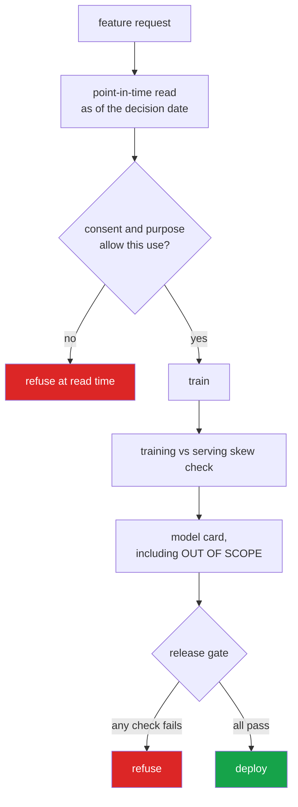

<h1 align="center">insurance-mlops (Python · point-in-time feature store · skew detection)</h1>
<p align="center"><i>The four things that actually break a deployed insurance model, solved in code rather than in a policy document</i></p>

<p align="center">
  <a href="#1-point-in-time-correctness">Point-in-time</a> &middot;
  <a href="#2-skew-is-not-drift">Skew vs drift</a> &middot;
  <a href="#3-model-cards-where-the-useful-half-is-out-of-scope">Model cards</a> &middot;
  <a href="#4-consent-and-purpose-limitation-enforced-at-read-time">Consent</a> &middot;
  <a href="#the-release-gate-refuses">The release gate</a> &middot;
  <a href="#problems-hit-while-building-this">Problems hit</a>
</p>

<p align="center">
  <a href="https://github.com/hammas159/insurance-mlops/actions/workflows/ci.yml"></a>
  
  
  
  <a href="LICENSE"></a>
</p>

---

## 1. Point-in-time correctness



Consent is enforced **at read time**, not reviewed afterwards - which is the difference
between a control and a policy document.


The most expensive bug in production ML, and the one that never appears in a notebook:

```
claim filed                      2026-03-01
fraud confirmed                  2026-05-14
prior_claims_count (today)       4
```

Training on today's `prior_claims_count` teaches the model a number that **did not
exist** when the decision had to be made. Offline accuracy is excellent. Online
accuracy collapses, and everyone blames drift.

A point-in-time join asks a different question — not *"what is this customer's claim
count?"* but *"what was it, as far as anyone knew, at 09:14 on the first of March?"*

```python
store.write("cust-1", "prior_claims", 1, event_time=t(1))
store.write("cust-1", "prior_claims", 4, event_time=t(60))

store.get_as_of("cust-1", "prior_claims", t(30)).value   # 1, not 4
```

### Reporting lag is modelled separately

Every value carries both when it **became true** and when it **became knowable**. A
claim filed Monday and entered Wednesday was not available to a model running Tuesday —
and pretending otherwise is the same bug wearing a hat.

The store refuses to record a value as knowable before it happened. That is a test.

**Staleness is reported too.** A point-in-time-correct feature can still be useless: a
risk score last refreshed eight months ago is technically legitimate and practically
fiction.

## 2. Skew is not drift

The distinction matters because the fixes are opposite:

| | What happened | Fix |
|---|---|---|
| **Drift** | The world changed. The model was right and reality moved. | Retrain |
| **Skew** | The two pipelines disagree. Training computes age in years, serving in months. | Retraining will not help |

Skew is more common and far harder to see, because **every component passes its own
tests**. It only appears when the pipelines are compared directly.

```python
detect_skew(training_rows, serving_rows)
# {"kind": "unit", "detail": "serving is 12x training - looks like years vs months",
#  "severity": "critical"}
```

Detected: missing/extra features, type changes, **unit mismatches by name**,
missingness gaps (usually a join that silently became an inner join), and values
outside the training range.

`safe_to_serve` is a **blocking verdict, not a dashboard tile**. Skew is not something
to watch trend upward — it means the pipelines disagree today.

## 3. Model cards, where the useful half is "out of scope"

```python
ModelCard.REQUIRED = ("intended_use", "out_of_scope", "training_data",
                      "owner", "limitations")
```

`out_of_scope` is the section that stops a claims-triage model being quietly
repurposed for pricing. An incomplete card is not a documentation debt — it blocks
release.

`to_markdown()` prints `UNASSIGNED` for a missing owner rather than omitting the line,
because an absent field reads as an oversight and an explicit `UNASSIGNED` reads as a
finding.

## 4. Consent and purpose limitation, enforced at read time

Pakistan's PDPA, like GDPR, ties personal data to the purpose it was collected for. A
dataset gathered for claims processing is **not** available for marketing because it
happens to live in the same warehouse.

```python
ledger.permitted(cohort, "claims")     # ["s1", "s2"]
ledger.permitted(cohort, "marketing")  # []
```

Two decisions worth stating:

- **Absence of a record is absence of consent.** Defaulting the other way is exactly
  how a marketing model ends up trained on claims data.
- **Withdrawal is not retroactive for a past query.** A model trained lawfully in March
  was lawful in March. Retroactive invalidation is a *different* obligation from
  deletion, and conflating them makes both harder to reason about.

Retention is a first-class operation, not a script someone remembers to run — and a
purged value stays purged, rather than silently falling back to an older record that
has been legally deleted.

## The release gate refuses

```python
ReleaseGate().evaluate(card=card, metrics=metrics, fairness=fairness, skew=skew)
# {"approved": False,
#  "failures": ["model card has not been reviewed",
#               "brier 0.400 above maximum 0.25",
#               "2 critical training/serving skew findings"],
#  "gate": "insurance-mlops/release/v1"}
```

Four properties of that design:

- **It refuses, it does not warn.** A gate that emits a warning is a gate that gets
  merged past on a Friday.
- **Calibration is checked separately from ranking.** A model can rank perfectly and be
  badly wrong about the level — and an insurer *prices* from the level.
- **A missing metric blocks.** Absent evidence is not evidence of adequacy.
- **Every failure is listed, not just the first.** One fix per deploy attempt is how a
  release takes a fortnight.

The gate is named in its own output, so the decision is attributable in an audit rather
than anonymous.

## Tests

**48 tests (42 core + 6 for the optional Streamlit demo). No dependencies, no data, no cloud.**

Point-in-time correctness is exact — a value either was knowable at a moment or it was
not — so leakage is *asserted*, not sampled for.

| Covered | |
|---|---|
| Point-in-time | later values invisible, latest-knowable wins, reporting lag, impossible availability refused, out-of-order backfills, decision-time training sets, staleness |
| Retention | purge before cutoff, series removal, purged values stay purged |
| Skew | unit mismatch named, missing/extra feature, missingness gap, type change, out-of-range, clean pipelines, blocking verdict |
| Model cards | completeness, every required field, `UNASSIGNED` owner, metrics rendered |
| Consent | purpose limitation, no-record default, withdrawal, non-retroactivity, pre-grant queries |
| Release gate | approval, each failure mode, missing metric, all failures listed, named gate |

## Where this sits

Deliberately does **not** re-implement what the neighbouring repos already do:

- Serving, canary and rollback → [`model-serving-platform`](https://github.com/hammas159/model-serving-platform)
- Drift monitoring → [`llm-observability-platform`](https://github.com/hammas159/llm-observability-platform)
- Scorecards, calibration, fairness metrics → [`credit-risk-engine`](https://github.com/hammas159/credit-risk-engine)

This one owns the parts of the lifecycle those do not: **what the model was trained on,
whether it is still the same pipeline, and whether it is allowed to ship.**

## Limits

- In-memory. A production feature store is Postgres or a columnar file; the as-of query
  and its correctness argument do not change.
- Skew detection compares batches. Per-request skew needs the serving path to log its
  computed features, which is the harder organisational problem rather than the harder
  technical one.
- The consent ledger models purpose and withdrawal, not lawful basis, data subject
  access or cross-border transfer. Those are real PDPA obligations and they are not
  here.
- No training code. Fitting is the easy part; this repo is the parts around it that
  decide whether the fit was valid.

## Keywords

MLOps &middot; insurance &middot; point-in-time correctness &middot; feature store &middot; data leakage &middot; training serving skew &middot; model cards &middot; model governance &middot; responsible AI &middot; GDPR &middot; consent management &middot; purpose limitation &middot; release gate &middot; actuarial modelling &middot; freMTPL2 &middot; regulated ML

## License

MIT

---

## Run it yourself

```bash
git clone https://github.com/hammas159/insurance-mlops
cd insurance-mlops

pip install -e .         # zero dependencies to resolve
pytest -q                # 48 tests, under a second
```

```python
from insurance import FeatureStore, detect_skew, ModelCard, ReleaseGate, ConsentLedger

store = FeatureStore()
store.write("cust-1", "prior_claims", 1, event_time=t(1))
store.write("cust-1", "prior_claims", 4, event_time=t(60))

store.get_as_of("cust-1", "prior_claims", t(30)).value    # 1, not 4
rows, labels = store.build_training_set(decisions, ["prior_claims"])

detect_skew(training_rows, serving_rows)["safe_to_serve"]

ReleaseGate().evaluate(card=card, metrics=metrics, fairness=fairness, skew=skew)
```

### Input / Output


`python demo.py`


Each refusal names the specific condition that failed, which is the only form of refusal
anyone can act on. v4.4.0 is the interesting one: the model is unchanged and its metrics
are identical to the approved v4.2.0. What failed is that `vehicle_age` arrives in months
at serving time and was trained in years — a fault no evaluation metric can see, because
the evaluation set has the training units.

## Problems hit while building this

**Modelling one timestamp per feature was not enough.** The first version recorded only
when a fact became *true*. But a claim filed on Monday and entered into the system on
Wednesday was not available to a model running on Tuesday — so a training set built from
event time still leaks, just less obviously. *Fixed* by carrying both `event_time` and
`available_at`, with the store refusing to record a value as knowable before it happened.

**Purging left a trapdoor.** After deleting values older than a retention cutoff, an
as-of query for an early date fell back to... nothing, correctly — but only because the
query is availability-ordered. It would have been easy to write a version that returned
the next surviving value instead, silently answering with data from the wrong period
*after* the correct data was legally deleted. There is now a test asserting a purged
value stays purged.

**Withdrawal of consent was almost made retroactive.** The instinct is that withdrawing
consent invalidates past use. It does not: a model trained lawfully in March was lawful
in March, and retroactive invalidation is a *different* obligation from deletion.
Conflating them makes both harder to reason about, so `permits(purpose, at=...)` answers
for the moment asked, and that asymmetry is a test.
